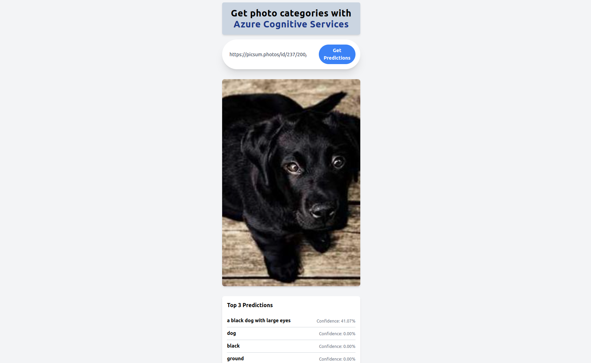

# Image Categorization with Azure Cognitive Services

This project is a web application built with Next.js and TypeScript that allows users to categorize images using Azure Cognitive Services.

## Features

- Upload and categorize images using Azure Cognitive Services
- View categorized images with corresponding tags

## Installation and Usage

1. Clone the repository.
2. Run `npm install` to install dependencies.
3. Set the following environment variables:
   - `AZURE_COGNITIVE_SERVICES_KEY`: Your Azure Cognitive Services key
   - `AZURE_COGNITIVE_SERVICES_ENDPOINT`: Your Azure Cognitive Services endpoint
4. Run `npm run dev` to start the development server.
5. Open the application in your browser at `http://localhost:3000`.

## Technologies Used

- Next.js
- TypeScript
- Azure Cognitive Services

## Credits

This project was created by FallIntoPlace. 

## License

This project is licensed under the [MIT License](LICENSE).
